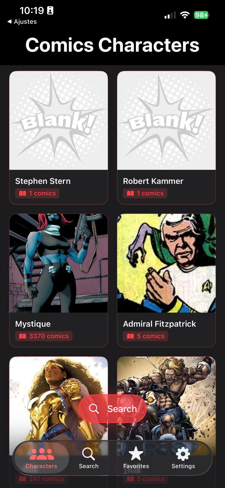
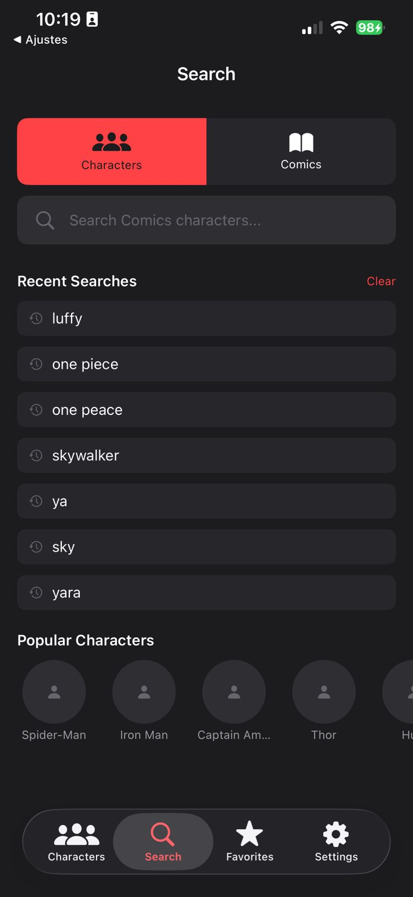
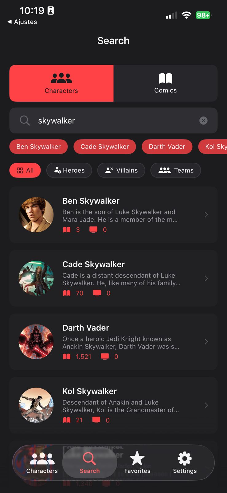
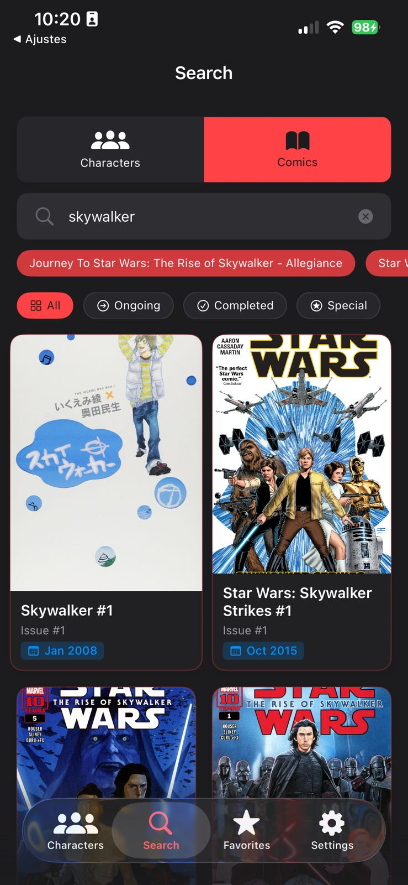
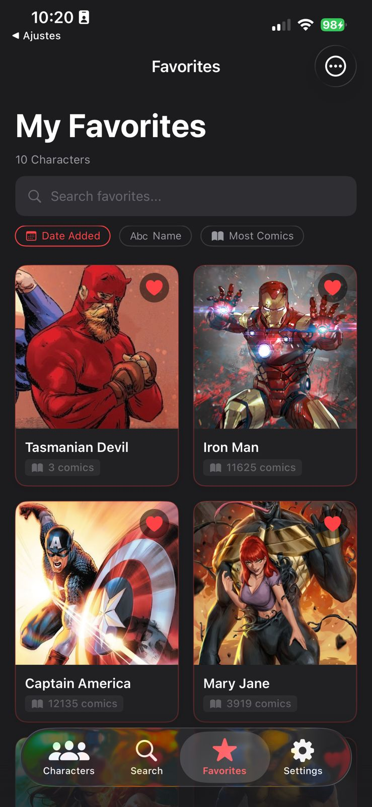
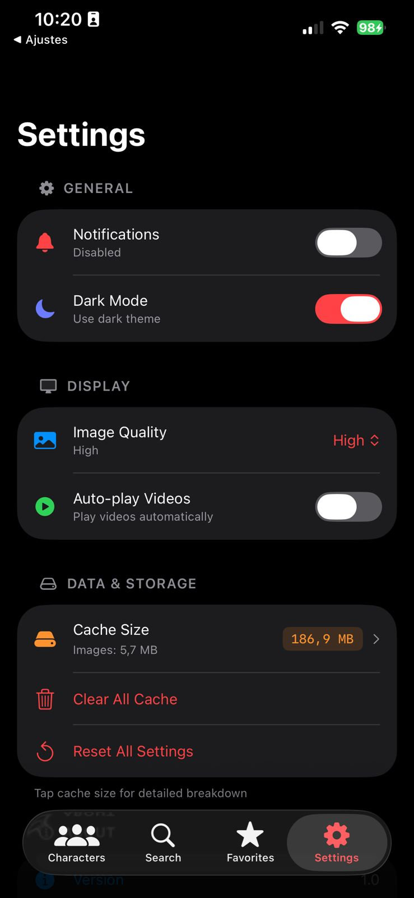

# ComicVine App

Aplicativo iOS que consome a [ComicVine API](https://comicvine.gamespot.com/api/) para exibir informações sobre personagens e quadrinhos, permitindo busca, visualização de detalhes, gerenciamento de favoritos e navegação por edições relacionadas.

## Índice

- [Screenshots](#screenshots)
- [Requisitos](#requisitos)
- [Configuração da API Key](#configuração-da-api-key)
- [Como Rodar o Projeto](#como-rodar-o-projeto)
- [Arquitetura](#arquitetura)
- [Estrutura de Módulos](#estrutura-de-módulos)
- [Funcionalidades](#funcionalidades)
- [Testes](#testes)
- [Dependências Externas](#dependências-externas)

## Screenshots

<p align="center">
  
  
  
</p>

<p align="center">
  
  
  
</p>

## Requisitos

- **Xcode 16.0+** (necessário para Swift 6.2 e Swift Package Manager)
- **iOS 16.0+** como deployment target
- **Swift 6.2**
- Conta na [ComicVine API](https://comicvine.gamespot.com/api/) para obter uma API key gratuita

## Configuração da API Key

O projeto utiliza um arquivo `.xcconfig` para armazenar a chave da API de forma segura, fora do controle de versão.

1. Navegue até a pasta `ComicApp/ComicApp/Config/`.

2. Localize o arquivo modelo `Secrets-model.xcconfig`. Este arquivo serve como template e mostra o formato esperado.

3. Crie uma cópia desse arquivo na mesma pasta com o nome **`Secrets.xcconfig`**:

   ```
   cp Secrets-model.xcconfig Secrets.xcconfig
   ```

4. Abra o `Secrets.xcconfig` e insira sua API key obtida no site da ComicVine:

   ```
   COMIC_VINE_API_KEY = SUA_CHAVE_AQUI
   ```

5. Verifique que o arquivo `Secrets.xcconfig` está listado no `.gitignore` do projeto para não ser commitado acidentalmente.

> **Importante:** Sem essa configuração, o app irá encerrar com um `fatalError` na inicialização, informando que a chave não foi encontrada.

## Como Rodar o Projeto

1. Clone o repositório:

   ```bash
   git clone https://github.com/ivantonial/ComicApp.git
   cd ComicApp
   ```

2. Configure a API key seguindo as instruções da seção anterior.

3. Abra o projeto no Xcode:

   ```bash
   open ComicApp.xcodeproj
   ```

4. Aguarde o Xcode resolver automaticamente todas as dependências via Swift Package Manager. Os pacotes locais (módulos internos) e remotos (Alamofire, Swift Crypto) serão baixados e vinculados automaticamente.

5. Selecione um simulador ou dispositivo com iOS 16.0+ como destino.

6. Pressione `Cmd + R` para compilar e executar.

## Arquitetura

O projeto adota o padrão **MVVM-C (Model-View-ViewModel-Coordinator)** com arquitetura modular baseada em **Swift Packages locais**.

O `AppCoordinator` atua como coordenador central, gerenciando a navegação entre as telas via `NavigationStack` e `NavigationPath` para cada aba do `TabView`. Os serviços são instanciados no coordenador e injetados nas ViewModels através de factory methods, seguindo o princípio de inversão de dependência.

```
ComicApp (Host)
└── Modules/
    ├── Core                → Protocolos base e utilitários
    ├── Networking          → Camada de rede (Alamofire)
    ├── ComicVineAPI        → Modelos, serviços e use cases da API
    ├── Cache               → CoreData + gerenciamento de cache
    ├── DesignSystem         → Componentes visuais e temas
    ├── AppCoordinator      → Coordenador principal (MVVM-C)
    └── Features/
        ├── CharacterList   → Lista de personagens
        ├── CharacterDetail → Detalhes do personagem
        ├── ComicsList      → Lista de quadrinhos
        ├── Favorites       → Gerenciamento de favoritos
        ├── Search          → Busca de personagens e quadrinhos
        └── Settings        → Configurações do app
```

## Estrutura de Módulos

| Módulo | Responsabilidade |
|---|---|
| **Core** | Protocolos compartilhados (`Coordinator`, `FavoritesServiceProtocol`), `LoadingManager` e utilitários |
| **Networking** | Abstração da camada de rede com `NetworkServiceProtocol` e implementação via Alamofire |
| **ComicVineAPI** | Modelos de domínio (`Character`, `Comic`), serviço de API e use cases (`FetchCharactersUseCase`, etc.) |
| **Cache** | Stack CoreData para persistência local, `PersistenceManager` e `CacheManager` |
| **DesignSystem** | Componentes reutilizáveis (cards, botões, loading, filtros), sistema de temas com suporte a dark/light mode |
| **AppCoordinator** | Coordenação de navegação, injeção de dependências e gerenciamento de `NavigationPath` por aba |
| **CharacterList** | Listagem com paginação infinita, busca local com debounce e grid responsivo |
| **CharacterDetail** | Detalhes do personagem com estatísticas, conteúdo relacionado e ações de favoritar/compartilhar |
| **ComicsList** | Lista de quadrinhos com filtros contextuais e paginação |
| **Favorites** | Gerenciamento de favoritos com busca, ordenação, multi-seleção e compartilhamento |
| **Search** | Busca unificada de personagens e quadrinhos com filtros e ordenação |
| **Settings** | Configurações de tema, qualidade de imagem, gerenciamento de cache e status da API |

## Funcionalidades

- Listagem de personagens com scroll infinito e paginação automática
- Busca de personagens e quadrinhos com debounce
- Tela de detalhes com estatísticas, poderes, equipes e quadrinhos relacionados
- Sistema de favoritos com persistência local via CoreData
- Multi-seleção e compartilhamento em lote na tela de favoritos
- Filtros contextuais na lista de quadrinhos
- Alternância entre temas claro e escuro
- Configuração de qualidade de imagem
- Gerenciamento de cache com visualização de uso de disco

## Testes

O projeto utiliza os frameworks **Swift Testing** e **XCTest**. Cada módulo possui seu próprio target de testes com fixtures, mocks e doubles dedicados.

Para executar todos os testes:

```
Cmd + U
```

Ou via linha de comando:

```bash
xcodebuild test -project ComicApp.xcodeproj -scheme ComicApp -destination 'platform=iOS Simulator,name=iPhone 16'
```

## Dependências Externas

| Dependência | Versão | Uso |
|---|---|---|
| [Alamofire](https://github.com/Alamofire/Alamofire) | 5.8.0+ | Camada de rede HTTP |
| [Swift Crypto](https://github.com/apple/swift-crypto) | 3.0.0+ | Operações criptográficas |

Todas as dependências são gerenciadas automaticamente via **Swift Package Manager** e resolvidas pelo Xcode na primeira abertura do projeto.
